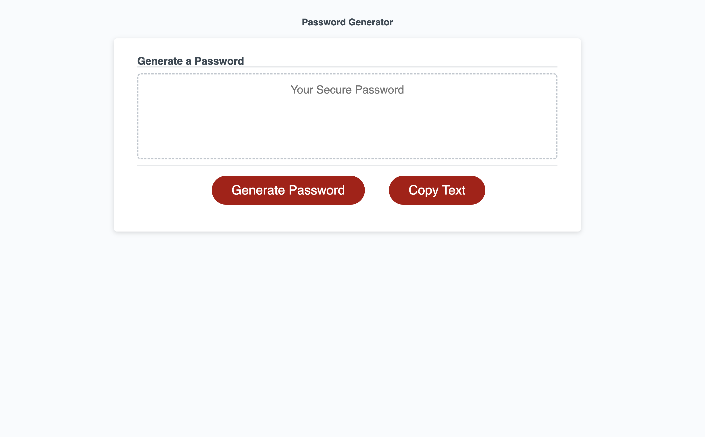

# Password Generator

## Description

Have you ever been prompted to create a password for a new account that you are signing up for, and felt like you ran out of passwords to use? Maybe you have used the same password for all of your online accounts and finally you would like to start anew! If you are confronted with any of these scenerios, then this application is for you!

I wanted to make an easy and accessible web application that allowed users to randomly generate passwords based of the criteria that they select. Selecting criteria is important because every 'sign-up' application does not accept the same types of passwords.

The criterias are:

- Password Length (8 - 128 characters)
- Lower Case Letters
- Upper Case Letters
- Numeric Characters
- Special Characters

Please Enjoy!

Site: https://dlockett133.github.io/password-generator/

## Usage

1. To use the Password Generator, you will first select the "Generate Password" button
2. You will be prompted to confirm the "length" of the password, followed by the inclusion of lowercase alphabets, uppercase alphabets, numeric characters, or "special" characters. You will have to choose at least ONE criteria for the generator to work.
3. After the password is generated, it will appear in the text box above.
4. Finally you can click the "Copy Text" button, and be alerted that you can now copy your newly generated password to your clipboard.

## Credits

N/A

## License

Please refer to the LICENSE in the repo.
